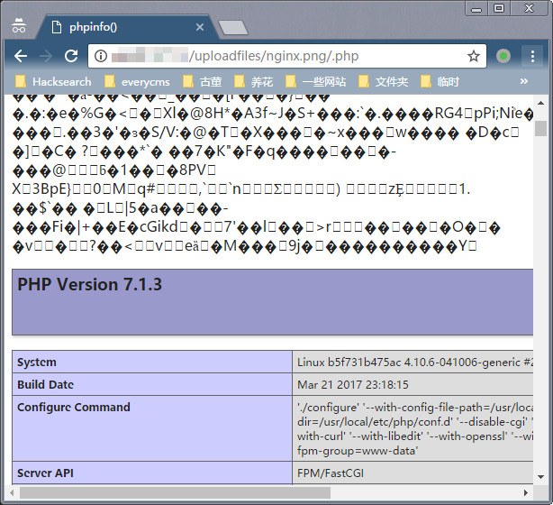
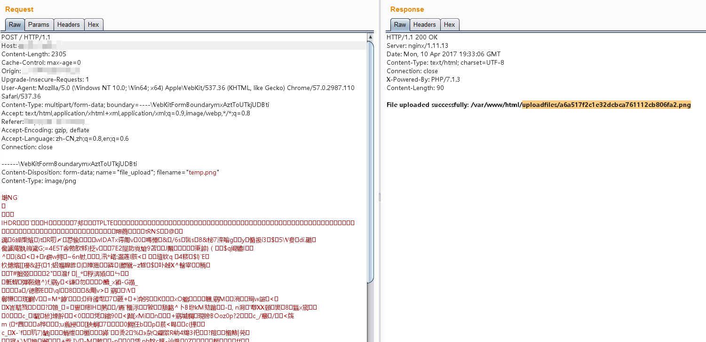

## Nginx 解析漏洞复现

### 环境版本信息：

- Nginx 1.x 最新版
- PHP 7.x 最新版

由此可知，该漏洞与 Nginx、php 版本无关，属于用户配置不当造成的解析漏洞。

#### 1、该环境需要两个 docker 容器，需要到两个文件夹下分别创建镜像

#### 2、到 nginx 目录下执行 `docker build -t nginx_parsing_vulnerability .` 创建 nginx 镜像

#### 3、到 php-fpm 目录下执行 `docker build -t php/fpm .` 创建 php-fpm 镜像

#### 4、要建立容器互联需要依赖容器的名字，使用 `--name` 指定源容器的名字。执行 `docker run -d --name php -p 9000:9000 php/fpm:latest` 启动容器，容器名为 php 

#### 5、通过 `--link` 选项指定要连接的容器，执行 `docker run -d --link php:php -p 80:80 -p 443:443 nginx_parsing_vulnerability:latest` 启动容器并建立连接

#### 6、启动后访问 `http://your-ip/uploadfiles/nginx.png` 和 `http://your-ip/uploadfiles/nginx.png/.php` 即可查看效果。

正常显示：

增加 `/.php` 后缀，被解析成 PHP 文件：

#### 7、访问 `http://your-ip/index.php` 可以测试上传功能，上传代码不存在漏洞，但可利用解析漏洞 getshell ：

